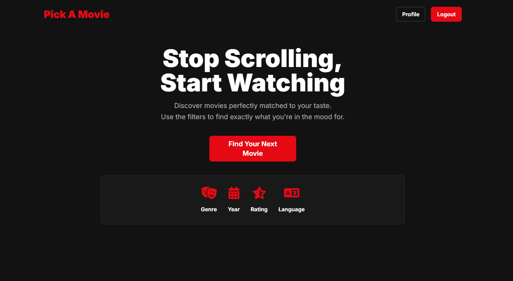

# Pick A Movie
Pick A Movie is a dynamic web application designed to solve the timeless problem of "what to watch." By providing a clean, intuitive interface with powerful filtering options, the app helps users discover movies perfectly suited to their mood and taste, offering a single, focused recommendation to eliminate decision fatigue.

This full-stack application is built with Python and the Django web framework, featuring user account management, personalized movie lists, and a responsive, modern frontend designed with Tailwind CSS.

**Live Demo:** [PickAMovie](https://pickamovie.pythonanywhere.com/)

## Features

### 🎬 For All Users:

- **Intuitive Filter Page:** The central hub of the application where users can specify their criteria to find a movie.
- **Multi-Faceted Filtering:** Users can filter movies by:
  - Genre
  - Year Range (From/To)
  - Minimum User Rating (from 4+ to 9+)
  - Language
- **Randomized Recommendation Engine:** Instead of showing a list, the app fetches a single random movie that perfectly matches the user's selected filters.

### 👤 For Registered Users:

- **Secure Account Management:** Full user authentication including registration, login/logout, and a secure account deletion process.
- **"Watch Later" List:** Save interesting movies to a personal "Watch Later" list.
- **"Watched" List:** Keep a history of movies you have seen by marking them as "Watched".
- **Personalized Profile Page:** A central dashboard displaying key stats (total movies watched, total on watch later) and a tabbed interface to view your saved movie lists.
- **Efficient List Management:** Easily move movies from "Watch Later" to "Watched" or delete them from your lists entirely.

### ✨ User Experience Enhancements:

- **Session-Based Prefetching:** The "Next Movie" button is instantaneous. The app prefetches a small "playlist" of movie IDs based on the initial search, pulling from this fast, local list until it's exhausted.
- **Auto-Dismissing Notifications:** User feedback, such as a successful account deletion, is displayed in a notification banner that automatically fades out.
- **Dynamic & Responsive UI:** The interface adapts based on authentication status and works seamlessly on both desktop and mobile devices.

## Tech Stack & Tools

### Backend:
- **Language:** Python 3
- **Web Framework:** Django
- **Web Server:** Gunicorn
- **API Interaction:** requests
- **Environment Management:** python-dotenv

### Frontend:
- **Styling:** Tailwind CSS
- **Templating:** Django Template Language (DTL)
- **JavaScript:** Vanilla JS for minor UX enhancements

### Database:
- **SQLite** 

### APIs & Services:
- **The Movie Database (TMDB):** The primary source of all movie data

### Deployment & DevOps:
- **Hosting Platform:** PythonAnywhere
- **Static File Serving:** Whitenoise
- **Version Control:** Git & GitHub

## Security Model

- **Secret Key Management:** The Django SECRET_KEY and external TMDB_API_KEY are stored as environment variables using a .env file locally and are set securely on the production server. They are never committed to version control.
- **CSRF Protection:** All forms that change state (login, signup, add/delete from lists) are protected with Django's built-in Cross-Site Request Forgery middleware and tokens.
- **Production Settings:** The application is deployed with DEBUG = False to prevent exposure of sensitive configuration data.
- **Allowed Hosts:** The ALLOWED_HOSTS setting is configured to only permit requests from the production domain, preventing HTTP Host header attacks.
- **User Data:** Password management is handled by Django's secure, built-in authentication system.
- **SQL Injection Prevention:** By using Django's ORM for all database queries, the application is protected against SQL injection vulnerabilities.

## Credits

- **The Movie Database (TMDB)** 
- **Django Project**
- **Tailwind CSS**

---

## License
This project is open-source and available under the [MIT License](LICENSE).

---
